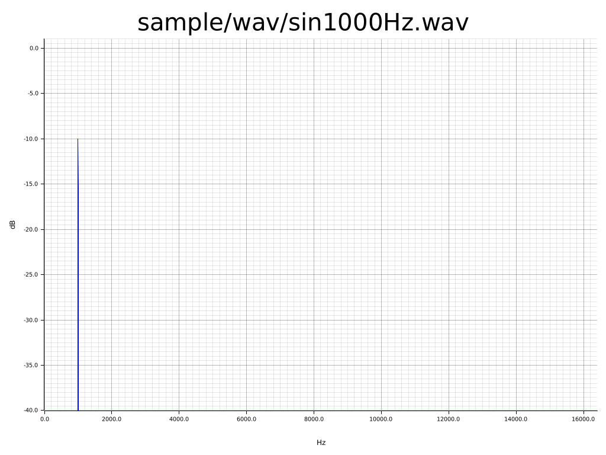
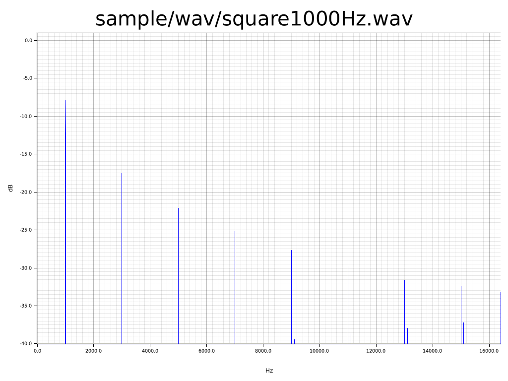

# これは何
これはwavのオーディオファイルをスペクトラム表示するプログラムです。

FFTの学習過程で作成しました。

窓関数にはハン窓関数を使っています。

# 使い方
スペクトラム表示したいファイルを`<target file>`に指定します。wav形式のみ対応してます。

デフォルトでは`plot.png`で保存されます。
```
cargo run --release -- <target file>
```

保存される画像を指定するには`-o`オプションを指定します。

```
cargo run --release -- <target file> -o <out file>
```

# サンプル
## 正弦波1000Hz

```
cargo run --release -- sample/wav/sin1000Hz.wav -o sample/img/sin1000Hz.png
```
出力画像



## 矩形波1000Hz

```
cargo run --release -- sample/wav/square1000Hz.wav -o sample/img/square1000Hz.png
```

出力画像


